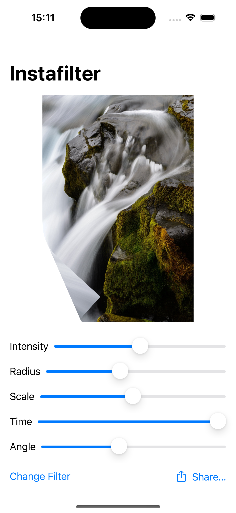
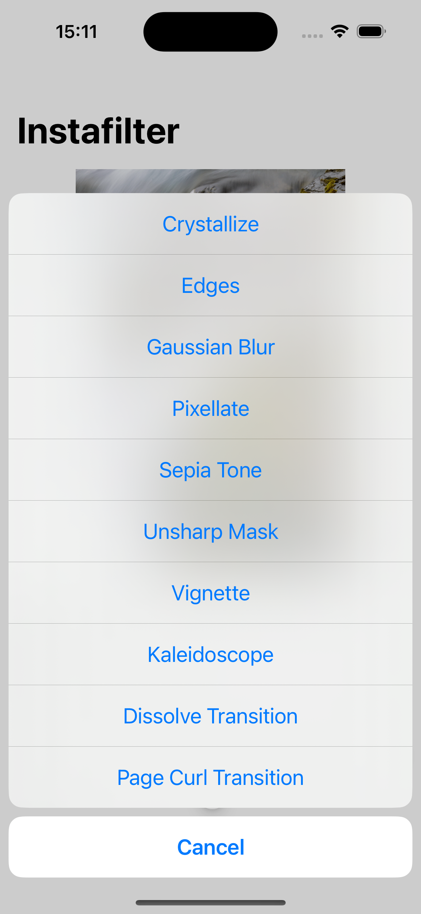
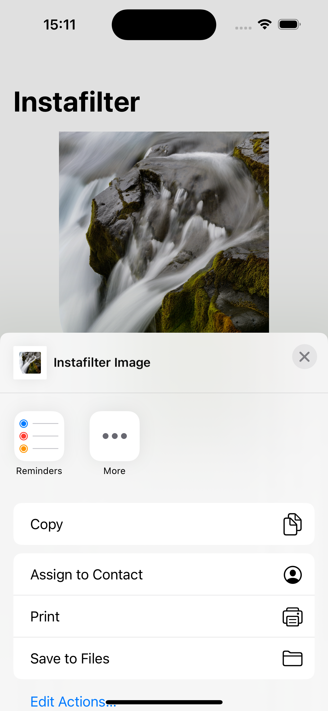

# Instafilter SwiftData - 100 Days of SwiftUI

## Overview

Welcome to Instafilter SwiftData! This project is part of the 100 Days of SwiftUI series.

## Introduction

Instafilter is a image editing app which contains a wide range of filters to edit from. This project will help you learn the fundamentals of SwiftUI, CoreImage, two powerful tools for iOS development.

## Setup and Installation

To get started with Instafilter, you will need:

- Xcode 12 or later
- A basic understanding of Swift programming
- An enthusiasm for learning SwiftUI and SwiftData

## Screenshots

## Credits

- **Developer:** Om Preetham Bandi
- **Framework:** SwiftUI

## License

This project is licensed under [LICENSE](LICENSE)
